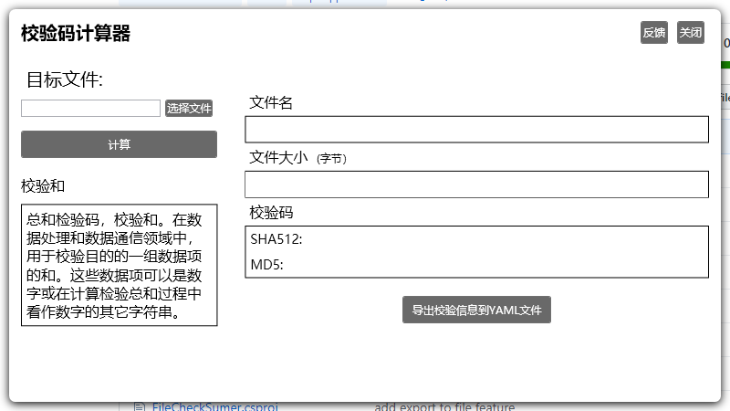

# FileCheckSumer
File checksum tool

## Description
File checksumer is checksum calculation application runs on Windows. It can calculte file checksum of different algorithms like MD5, SHA512...
Checksum calculation tool is usefule when you want check file completeness or deploy file to internet and privide completeness checksum code to user

## ScreenShot

## Issue
Github Issues is the fastest way to feedback or get troubleshoot support

## License
MIT, see [MIT](https://github.com/jingsong-liu/FileCheckSumer/blob/master/LICENSE) for details
